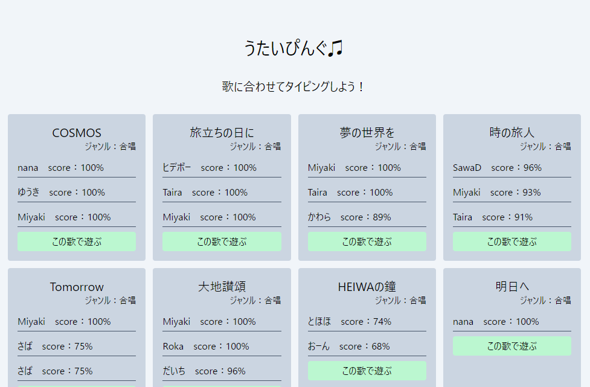

# 作成したアプリまとめ

2023 年 12 月 ～ 2024 年 5 月までに作成したアプリのまとめです。

| <a href="https://astoryer.com/ja" target="_blank">AStoryer - あすとりや -</a>                                                                                                                                                                                                                                                                                                                                                                                                                                                                                                                                                                                                                                                                                                                                                                                                                                                                                                                                                                                                                                                                                                                                                     | <a href="https://github.com/topi0247/Project-AStoryer" target="_blank" >リポジトリ</a>                                                                                                                       |
| --------------------------------------------------------------------------------------------------------------------------------------------------------------------------------------------------------------------------------------------------------------------------------------------------------------------------------------------------------------------------------------------------------------------------------------------------------------------------------------------------------------------------------------------------------------------------------------------------------------------------------------------------------------------------------------------------------------------------------------------------------------------------------------------------------------------------------------------------------------------------------------------------------------------------------------------------------------------------------------------------------------------------------------------------------------------------------------------------------------------------------------------------------------------------------------------------------------------------------- | :----------------------------------------------------------------------------------------------------------------------------------------------------------------------------------------------------------- |
|                                                                                                                                                                                                                                                                                                                                                                                                                                                                                                                                                                                                                                                                                                                                                                                                                                                                                                                                                                                                                                                                                                       | **【概要】**  TRPG で作成したイラストなどの創作物を投稿できるサービスです。 ディスプレイ絵、立ち絵、シナリオ終了後の後日談の絵など、TRPG で作成したプレイヤーキャラクターを中心として投稿できます。 |
|              | **【今後の展望】**  <ul><li>イラストの複数枚投稿</li><li>ネタバレワンクッション</li><li>フォロー機能</li><li>小説投稿</li></ul>など                                                                     |

### ミニアプリ

|                                                                                                                                                                                                                                                                                                                                                                                                <a href="https://kotonoha-tsumugi.vercel.app" target="_blank" >言の葉つむぎ</a>                                                                                                                                                                                                                                                                                                                                                                                                 |                                                                                                                                                                                                                                                                                                                                                            <a href="https://leaf-record.vercel.app" target="_blank">Leaf Record ～ 大草原不可避 ～</a>                                                                                                                                                                                                                                                                                                                                                             |
| :----------------------------------------------------------------------------------------------------------------------------------------------------------------------------------------------------------------------------------------------------------------------------------------------------------------------------------------------------------------------------------------------------------------------------------------------------------------------------------------------------------------------------------------------------------------------------------------------------------------------------------------------------------------------------------------------------------------------------------------------------------------------------------------------------------------------------------------------------------------------------: | :----------------------------------------------------------------------------------------------------------------------------------------------------------------------------------------------------------------------------------------------------------------------------------------------------------------------------------------------------------------------------------------------------------------------------------------------------------------------------------------------------------------------------------------------------------------------------------------------------------------------------------------------------------------------------------------------------------------------------------------------------------------------------------------------------------------: |
|  |                                                                                                                                                                                                                                                                                                                                                                                                                                                                                                                                                                    |
|                                                                                                                                                                                                                                                                                                                                                                                       起承転結でリレー小説が投稿できるサービスです。 Next.js×Rails のキャッチアップで作成しました。                                                                                                                                                                                                                                                                                                                                                                                       |                                                                                                                                                                                                                                                                                                                                                         メモ帳感覚で GitHub にコミットできるサービスです。 外部 API を使用する練習として作成しました。                                                                                                                                                                                                                                                                                                                                                         |
|                                                                      |          |
|                                                                                                                                                                                                                                                                                                                                                <a href="https://github.com/topi0247/KotonohaTsumugi" target="_blank">リポジトリ</a> / <a href="https://qiita.com/topi_log/items/3ef541d490ee4c332752" target="_blank">Qiita</a>                                                                                                                                                                                                                                                                                                                                                |                                                                                                                                                                                                                                                                                                                    <a href="https://github.com/topi0247/leaf-record" target="_blank">リポジトリ</a> / <a href="https://qiita.com/topi_log/items/d362fefb9e006773eac0" target="_blank">Qiita</a>                                                                                                                                                                                                                                                                                                                    |

|                                                                                                                                                                                                                                <a href="https://sweet-spot-topi.vercel.app/" target="_blank" >Sweet Spot!</a>                                                                                                                                                                                                                                 |                                                                                                                                                                              <a href="https://utyping-dbd8ac4df84a.herokuapp.com/" target="_blank">うたいぴんぐ ♫</a>                                                                                                                                                                              |
| :-------------------------------------------------------------------------------------------------------------------------------------------------------------------------------------------------------------------------------------------------------------------------------------------------------------------------------------------------------------------------------------------------------------------------------------------------------------------------------------------------------------------------------------------: | :------------------------------------------------------------------------------------------------------------------------------------------------------------------------------------------------------------------------------------------------------------------------------------------------------------------------------------------------------------------------------------------------------------------------------------------------: |
|                                                                                                                                                                                                                                                                                                                                                                                                                                |                                                                                                                                                                                                                                                                                                                                                                                                               |
|                                                                                                                                                                                                                             バレンタインチョコ共有サービスです Next.js のキャッチアップとして作成しました。                                                                                                                                                                                                                              |                                                                                                                                                               YouTube 動画に合わせてタイピングするサービスです。 スクール内イベントに応募するために  2 日で作成しました。                                                                                                                                                                |
|       |      |
|                                                                                                                                                                                                                                <a href="https://github.com/topi0247/Sweet-Spot" target="_blank">リポジトリ</a>                                                                                                                                                                                                                                |                                                                                                                                                                                    <a href="https://github.com/topi0247/utyping" target="_blank">リポジトリ</a>                                                                                                                                                                                    |
