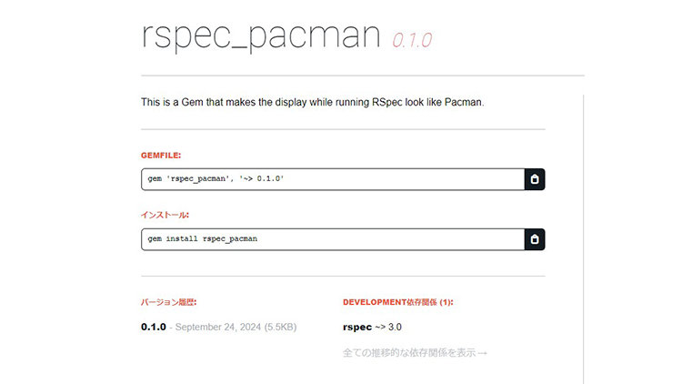

# 開発サービスまとめ
2024/12 ～ 現在

## サービス公開中

| <a href="https://kotonoha-tsuduri.vercel.app" target="_blank" >言の葉つづり</a> | <a href="https://kotonoha-tsumugi.vercel.app" target="_blank" >言の葉つむぎ</a> |
| :--: | :--: |
|  |  |
| 起承転結でリレー小説が投稿できるサービス | 手紙を通してリレー小説が投稿できるサービス |
| 開発期間：1週間 / <a href="https://github.com/topi0247/KotonohaTsuduri" target="_blank">リポジトリ</a> / <a href="https://qiita.com/topi_log/items/3d7dafa5240b0a4dc66e" target="_blank">Qiita</a> | 開発期間：2週間 / <a href="https://github.com/topi0247/KotonohaTsuduri" target="_blank">リポジトリ</a> / <a href="https://qiita.com/topi_log/items/3d7dafa5240b0a4dc66e" target="_blank">Qiita</a> |
|    |    |

| <a href="https://leaf-record.vercel.app" target="_blank">Leaf Record ～ 大草原不可避 ～</a> | <a href="https://talk-deck.vercel.app">TALK DECK</a> |
| :--: | :--: |
|  |  |
| メモ帳感覚で GitHub にコミットできるサービス | シチュエーションと会話デッキを投稿するサービス |
| 開発期間:1週間 / <a href="https://github.com/topi0247/leaf-record" target="_blank">リポジトリ</a> / <a href="https://qiita.com/topi_log/items/d362fefb9e006773eac0" target="_blank">Qiita</a> | 開発期間:2週間 / <a href="https://github.com/topi0247/talk-deck">リポジトリ</a> |
|    |    |

| <a href="https://rubygems.org/gems/rspec_pacman" target="_blank">rspec_pacman</a> | <a href="https://react-todo-app-90cf1.web.app">React Todo App</a> |
| :--: | :--: |
|  |  |
| Rspecの表示をパックマンっぽく表示できるGem | Mattermostへ送れるTodoアプリ |
| 開発期間:1日 / <a href="https://github.com/topi0247/rspec_pacman" target="_blank">リポジトリ</a> | 開発期間:1週間 / <a href="https://github.com/topi0247/react-practice-todoapp">リポジトリ</a> / キャッチアップ |
|   |  |

| 【チーム開発】<a href="https://pythagora-maker.vercel.app">Pythagora maker</a> |
| :--: |
|  |
| 新感覚パズルゲーム |
| 開発期間:2ヶ月 / <a href="https://github.com/raito2180/pythagora_maker">リポジトリ</a> |
|   |

### 身内向け

| <a href="https://help-master.onrender.com">RUNEQ HELP MASTER.</a> | <a href="https://battrun-showcase.vercel.app">BATTRUN SHOW CASE バトランへの挑戦</a> |
| :--: | :--: |
|  |  |
| RUNTEQのヘルプページより出題するクイズ | RUNTEQイベント「BATTLE OF RUNTEQ」の 非公式アプリ紹介サービス |
| 開発期間:1週間 / <a href="https://github.com/topi0247/help_master.">リポジトリ</a> | 開発期間:1ヶ月弱 / <a href="https://github.com/topi0247/BattleOfRunteq5">リポジトリ</a> |
|   |  |

| <a href="https://runteq-fes-5th-judge.vercel.app">第5回RUNTEQ祭審査員紹介</a> | <a href="https://runteq-fes-vol5.vercel.app">第5回RUNTEQ祭応募アプリ</a> |
| :--: | :--: |
|  |  |
| 第5回RUNTEQ祭審査員紹介サービス | 第5回RUNTEQ祭応募アプリ一覧サービス |
| 開発期間:2週間 / <a href="https://github.com/topi0247/runteq_fes_5th_judge">リポジトリ</a> | 開発期間:1ヶ月弱 / <a href="https://github.com/topi0247/runteq-fes-5th">リポジトリ</a> |
|  |  |

| <a href="https://runteq-hogehoge-list.vercel.app">らんすた</a> |
| :--: |
|  |
| RUNTEQのMattermostサーバーにあるカスタムスタンプ一覧 |
| 開発期間:2日 / <a href="https://github.com/topi0247/runteq-emoji-list">リポジトリ</a> |
|  |

## サービス停止中

| AStoryer - あすとりや - | 他力本願Todo |
| :--: | :--: |
|  |  |
| TRPG向けイラスト投稿サービス | 誰かにやってほしいTodoを投稿するサービス |
| 開発期間:2ヶ月 / <a href="https://github.com/topi0247/Project-AStoryer" target="_blank" >リポジトリ</a> | 開発期間:1ヶ月弱 / <a href="https://github.com/topi0247/tarikihongan-todo">リポジトリ</a> |
|    |     |

| RailsCodeReviews | Sweet Spot! |
| :--: | :--: |
|  |  |
| Railsアプリをコードレビューしてくれるサービス | バレンタインチョコレートシェアサービス |
| 開発期間:1週間 / <a href="https://github.com/topi0247/CodeReview" target="_blank" >リポジトリ</a> | 開発期間:1週間 / <a href="https://github.com/topi0247/Sweet-Spot">リポジトリ</a> |
|   |  |

| うたいぴんぐ♫ | ひとときアルバム |
| :--: | :--: |
|  |  |
| Railsアプリをコードレビューしてくれるサービス | お子さんの「はじめて」を写真に残す記録サービス |
| 開発期間:2日 / <a href="https://github.com/topi0247/utyping" target="_blank">リポジトリ</a> | 開発期間:1週間 / <a href="https://github.com/topi0247/mini-app-week">リポジトリ</a> |
|   |  |

### チーム開発 & 身内向け

| RUNTECKER | runteq overflow |
| :--: | :--: |
|  |  |
| RUNTEQ生がお互いを知れるアプリ | RUNTEQ生向けアプリ開発質疑応答掲示板 |
| 開発期間:2ヶ月 / <a href="https://github.com/rayto298/runtecker" target="_blank">リポジトリ</a> | 開発期間:2.5ヶ月 / <a href="https://github.com/project-rqb/project-rqb">リポジトリ</a> |
|    |    |

## その他

| link_to_project_with_field |
| :--: |
| GitHubProjectにプルリクやissueを自動で紐づけし フィールド設定してくれるGitHubActions |
| 開発期間:1週間 / <a href="https://github.com/topi0247/link_to_project_with_field" target="_blank">リポジトリ</a> |